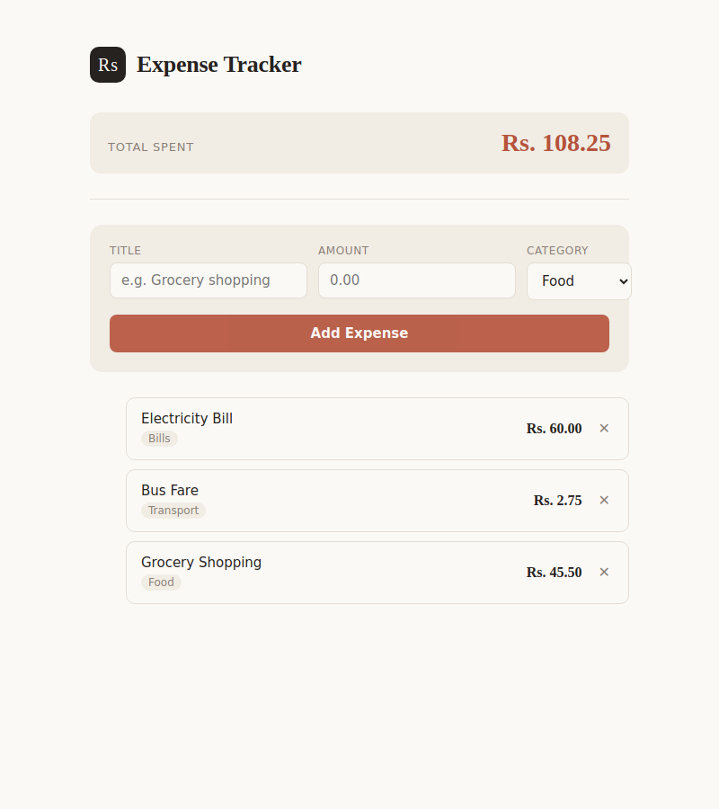

# Expense Entry System

A React app for adding and tracking daily expenses, built for the Week 2 (Wednesday) task: **Forms & State Management**.

## Features

- Controlled form with **Title**, **Amount**, and **Category** inputs
- Handles form submission and validates input before adding an expense
- Stores expenses in React state
- Displays all added expenses dynamically in a list
- Delete any expense from the list
- Running total of all expenses shown at the top

## Screenshot



## Tech Stack

- React 19
- Vite

## Project Structure

```
expense-tracker/
├── src/
│   ├── components/
│   │   ├── Header.jsx        # Shows app title and running total
│   │   ├── ExpenseForm.jsx   # Controlled form (title, amount, category)
│   │   ├── ExpenseList.jsx   # Renders the list of expenses
│   │   └── ExpenseItem.jsx   # Single expense row with delete button
│   ├── App.jsx                # Holds state, wires components together
│   ├── App.css
│   ├── index.css
│   └── main.jsx
├── index.html
└── package.json
```

## Getting Started

Install dependencies:

```bash
npm install
```

Run the development server:

```bash
npm run dev
```

Then open the URL shown in the terminal (usually `http://localhost:5173`).

Build for production:

```bash
npm run build
```

## Topics Covered

- Controlled components
- Form handling in React
- State management with `useState`
- Handling multiple inputs in one form
- Deleting items from state
